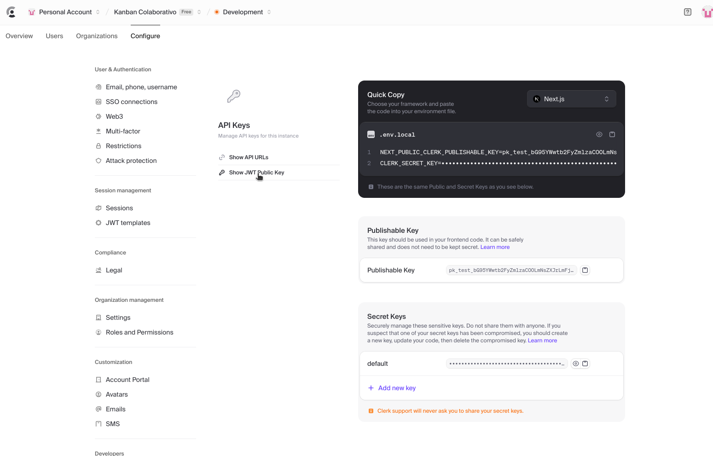
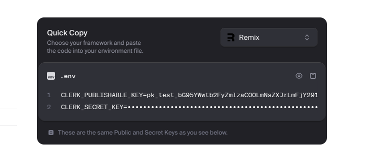

# Desafio Técnico: Sistema de Quadro Kanban

Esse repositório contém o frontend e o backend de um sistema de Kanban colaborativo, feito para o desafio da IGC.

# Conteúdo

- [Desafio Técnico: Sistema de Quadro Kanban](#desafio-técnico-sistema-de-quadro-kanban)
- [Conteúdo](#conteúdo)
  - [Como executar](#como-executar)
    - [Backend](#backend)
    - [Frontend](#frontend)
  - [Implementações](#implementações)
    - [Drag and Drop](#drag-and-drop)
    - [Estado entre colunas do Drag and Drop](#estado-entre-colunas-do-drag-and-drop)
  - [Próximos passos](#próximos-passos)
  - [CI/CD](#cicd)
  - [Tecnologias utilizadas](#tecnologias-utilizadas)
    - [Remix](#remix)
    - [Shadcn](#shadcn)
    - [Tailwind](#tailwind)
    - [NestJS](#nestjs)
    - [Prisma](#prisma)
    - [SQLite](#sqlite)
    - [TipTap](#tiptap)
  - [Progresso](#progresso)

## Como executar

### Backend

Em primeiro lugar, deve-se entrar na pasta do backend e criar o arquivo com variáveis de ambiente. Pode-se fazê-lo a partir do exemplo fornecido:

```sh
cd backend
cp .env.example .env
```

Depois, é preciso criar uma conta no [Clerk](https://dashboard.clerk.com/sign-up?redirect_url=https%3A%2F%2Fdashboard.clerk.com%2F). Entrando na dashboard, acessar `Configure > API Keys > Show JWT Public Key`:



Copie a "JWKS URL" e coloque-a como o valor de `CLERK_ISSUER_URL=` no arquivo .env **SEM A PARTE `/.well-known/jwks.json`**.

A variável `DATABASE_URL=` pode ser mantida como está no `.env.example`.

Para executar o backend, é preciso ter o `pnpm` instalado.

Com o `pnpm`, executar, na pasta raiz desse repositório:

```
pnpm install
pnpm prisma migrate dev
pnpm start:dev
```

### Frontend

Primeiro, entrar na pasta do frontend criar o arquivo com variáveis de ambiente:

```sh
cd frontend
cp .env.local.example .env.local
```

Novamente, acessar a dashboard do Clerk e dessa vez copiar em "Quick Copy", selecionando a framework como Remix:



Colar o que foi copiado no lugar de:

```
CLERK_PUBLISHABLE_KEY=
CLERK_SECRET_KEY=
```

Para executar o frontend, também é preciso ter o `pnpm` instalado.

Com o `pnpm`, executar, na pasta raiz desse repositório:

```
pnpm install
pnpm dev
```

## Implementações

### Drag and Drop

O Drag and Drop foi desenvolvido usando a biblioteca `dnd-kit`. A principal fonte de inspiração foi [esse tutorial](https://blog.logrocket.com/build-kanban-board-dnd-kit-react/#sensors).

### Estado entre colunas do Drag and Drop

O estado entre as colunas foi mantido basicamente com a implementação da função `onDragEnd` no `DndContext` fornecido pela biblioteca, e a sincronização entre diferentes usuários usando a aplicação foi feita usando web sockets, com eventos enviados pelo back-end quando há alterações nas colunas.

## Próximos passos

Os principais próximos passos seriam:

- Implementar responsividade e suporte do Kanban para telas touch
- Tornar o backend mais robusto com verificações de validade das informações enviadas pelo frontend
- Gerar alertas de erro em caso de erros de conexão ou inputs inválidos no front-end.
- Verificar, no backend, a validade dos usuários (no Clerk) escolhidos como responsáveis pelas tasks.
- Melhoria das estilizações em alguns pontos que não estão tão bons.

## CI/CD

Para desenvolver CI/CD, poderia ser usado o GitHub actions. para isso, bastaria criar um arquivo YML numa pasta `.github` com instruções declarativas de como fazer o deploy, e colocar secrets no repositório contendo host e senha do servidor.

Caso fosse usada a Vercel como host, nem seria necessária a criação do arquivo, apenas conectar o repositório na conta da Vercel.

## Tecnologias utilizadas

### Remix

Visto que não se podia usar o Next.js, que já conhecia, utilizei o Remix como framework react. Embora nunca tivesse usado, foi bastante fácil de aprender, visto que a comunicação entre o código server-side e client-side é muito fluida, com a utilização de forms HTML no cliente e `loaders`e `actions` no servidor.

### Shadcn

Utilizei o shadcn por ser uma ferramenta que gera automaticamente componentes bonitos e fácies de usar, usando Tailwind. Os arquivos em `frontend/app/components/ui` são todos gerados automaticamente pela CLI do Shadcn, com poucas alterações minhas quando necessário

### Tailwind

Usei pois torna muito mais rápida a estilização, sem precisar criar outros arquivos e com muitos recursos prontos, além da fácil integração com o Shadcn.

### NestJS

Embora em projetos grandes possa ser um tanto verboso e pouco flexível, é muito fácil construir um backend do zero com o Nest, acho a documentação excelente.

### Prisma

O melhor ORM em JavaScript na minha opinião, muito fácil de descrever as tabelas na linguagem própria e gera automaticamente tipos para TypeScript.

### SQLite

Usei pela simplicidade em executar, sem a necessidade de containers e conexão por URLs. Pode não ser a melhor escolha para projetos grandes, mas é muito fácil de usar no começo.

### TipTap


Usei para fazer o editor rich-text, devido à fácil integração com o Shadcn. Me inspirei majoritariamente no exemplo presente [nesse site](https://shandcn-ui-extensions.vercel.app/editor).


## Progresso

- [ ] Frontend
  - [x] Kanban
    - [x] Colunas dinâmicas
    - [x] Títulos de colunas editáveis
    - [x] Excluir colunas
    - [x] _Drag And Drop_
    - [x] Clicar para abrir edição da tarefa
    - [x] Criar novos cards
  - [x] Tarefas
    - [x] Título editável
    - [x] Descrição editável
    - [x] Descrição com editor _rich text_
    - [x] Prioridade editável
    - [x] Atribuição editável
    - [x] Excluir
    - [x] Mostrar histórico de alterações
  - [x] Autenticação
    - [x] Página inicial para usuários não autenticados
    - [x] Gerenciamento de autenticação com o Clerk
    - [x] Edição simultânea
  - [ ] Responsividade
- [x] Backend
  - [x] Tabela de colunas
    - [x] Criação
    - [x] Exclusão
    - [x] Edição
  - [x] Tabela de tarefas
    - [x] Criação
    - [x] Exclusão
    - [x] Edição
  - [x] Histórico de movimentação dos cards
  - [x] Histórico de edição das tasks
  - [x] Autenticação
- [x] Documentação
  - [x] Explicar escolha das tecnologias
    - [x] Remix
    - [x] Shadcn
    - [x] NestJS
    - [x] Clerk
    - [x] Prisma
    - [x] SQLite
    - [x] TipTap
  - [x] Explicar os próximos passos
